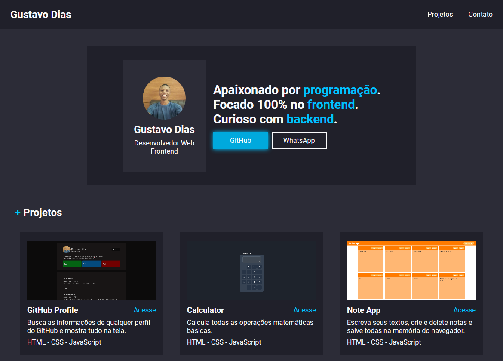

 

   
  <h1 align="center">Gustavo Dias Portfolio</h1>

## Objective

After a few months studying frontend, doing small projects, training Vanilla JS on my machine and finishing 14 modules of the Programador BR course, I come here to demonstrate all my progress on this website. See, the final result of my projects, the codes available on GitHub and what I have to offer for the job market. Thanks for listening.

## Demo

Access the <a href="https://gustavodiasdev.netlify.app/" target="_blank">demonstration</a>.

## Status

Not finished.

## Font Family

Nunito (Google Fonts)

## Colors

white: #FAFAFC 
blue: #00C2FF 
dark: #20202A 
clear: #2C2C37 

## My Contacts

- <a href="https://www.linkedin.com/in/gustavo-dias-3100211b6/">Linkedin</a>
- <a href="https://www.instagram.com/eu.gustavodias/">Instagram</a>

## License

Distributed under the MIT license. See `LICENSE` for more information.
